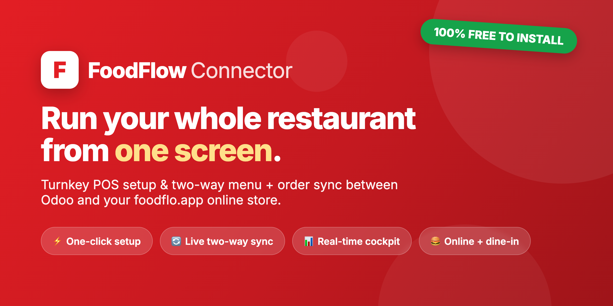
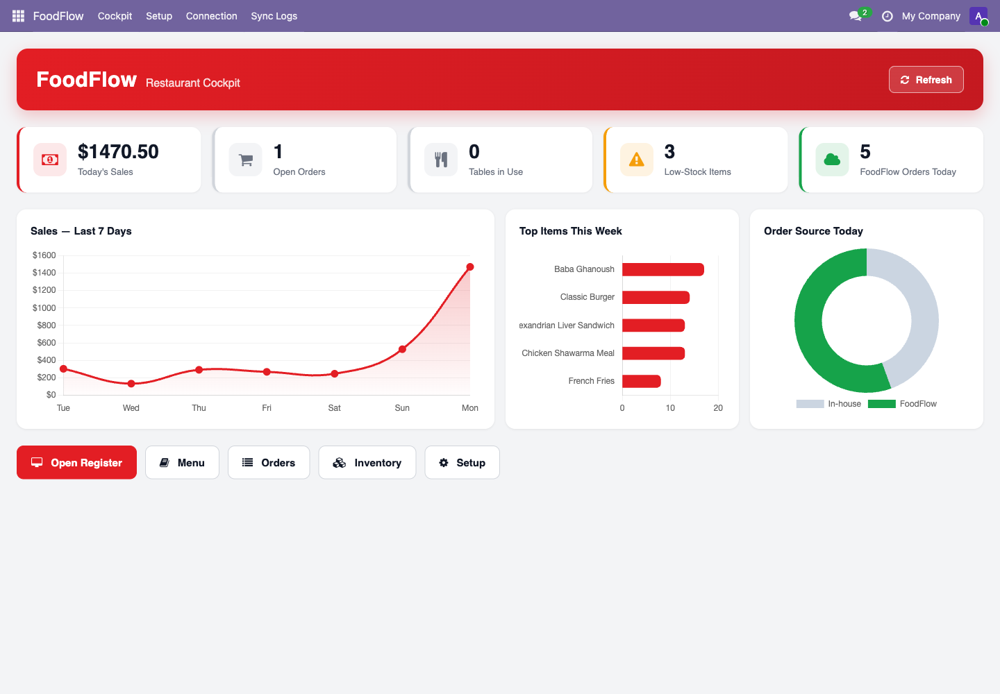
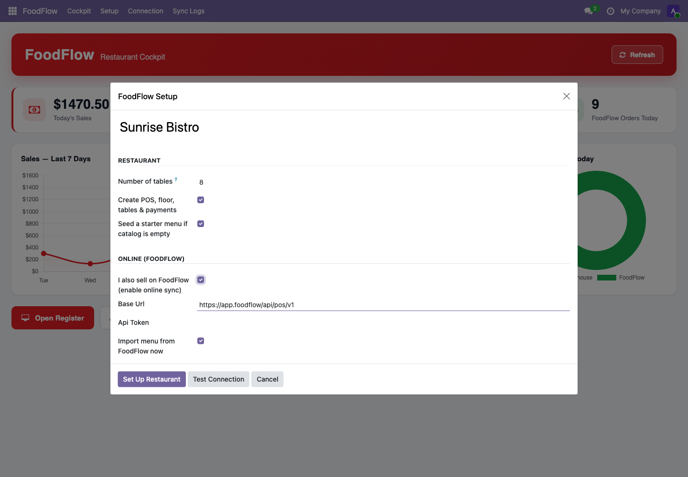
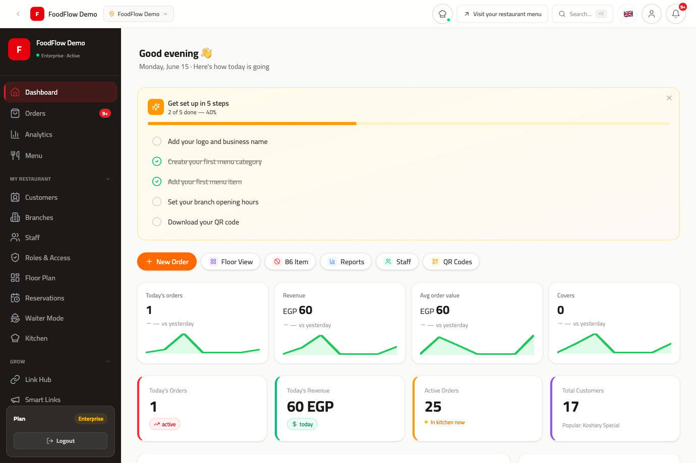

# FoodFlow Connector for Odoo

> **Turn your Odoo POS into an online ordering machine.**
> Install this free connector, link your [foodflo.app](https://foodflo.app) account, and start
> taking **online orders, delivery & QR dine-in** that flow straight into Odoo — no double entry.



[](https://www.odoo.com)
[](LICENSE)
[](#)
[](https://foodflo.app)

---

## Why restaurants choose foodflo.app

[**foodflo.app**](https://foodflo.app) is the all-in-one online platform that grows your sales while
this connector keeps everything in sync with Odoo. One subscription replaces a pile of expensive
tools — and it pays for itself with a single extra order a day.

- 📱 **Your own branded online store** — digital menu, delivery & pickup, QR table ordering
- 💸 **Keep 100% of every order** — no 25–30% marketplace commissions
- ⚡ **Live in minutes** — your Odoo menu publishes online automatically
- 🍽️ **Kitchen display & reservations** — full front-of-house, included
- 👥 **Own your customer data** — insights a marketplace never gives you
- 🔄 **Zero double entry** — online orders land in Odoo POS automatically

### 👉 [Start free on foodflo.app](https://foodflo.app)

---

## What the connector does

| | Feature |
|---|---|
| ⚡ | **One-click setup wizard** — provisions POS, dining floor, tables, payment methods and a starter menu (idempotent, safe to re-run) |
| 🔄 | **Bidirectional sync** — menu items push to foodflo.app; online orders pull into Odoo POS on a schedule you control |
| 📊 | **Real-time Restaurant Cockpit** — sales, orders, tables, low-stock and online activity with interactive charts |
| 🔌 | **Connection testing & sync logs** — validate your API connection and audit every sync |
| 🍔 | **Online + dine-in, unified** — one menu, one order stream |

---

## Screenshots

### Real-time cockpit


### One-click setup, connects to foodflo.app


### The foodflo.app online platform


---

## Installation

1. Copy the `foodflow_connector` folder into your Odoo `addons` path
   (or clone this repo and add its directory to `addons_path`):
   ```bash
   git clone https://github.com/megz2020/foodflow-connector.git
   ```
2. Update the app list and install **FoodFlow Connector** (Apps → search "FoodFlow").
3. Open the **FoodFlow** app and run the **Setup** wizard.
4. To sell online, tick *"I also sell on FoodFlow"*, paste your
   [foodflo.app](https://foodflo.app) API token, click **Test Connection**, then **Set Up Restaurant**.

**Requires:** `point_of_sale`, `pos_restaurant` (Odoo 19).
The POS & cockpit features work standalone; a foodflo.app account unlocks online ordering.

---

## License

Licensed under the **Odoo Proprietary License v1.0 (OPL-1)** — free to install and use, but
publishing, redistributing, sublicensing or selling copies is **not permitted** without written
permission. See [LICENSE](LICENSE).

"FoodFlow" and "foodflo.app" are brands of the author. Use of the code does not grant any right to
use the names or logos, or to imply endorsement.

---

<p align="center"><b>Ready to sell more, commission-free?</b><br/>
<a href="https://foodflo.app">Start free on foodflo.app</a></p>
